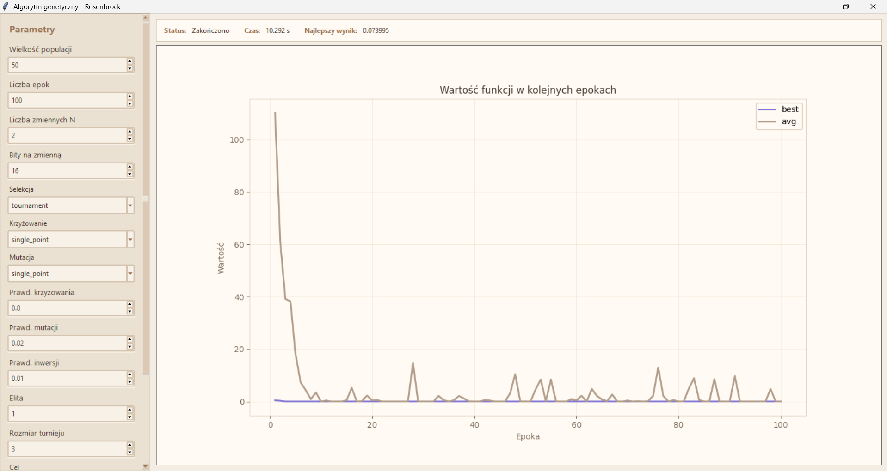

# Genetic Algorithm - Rosenbrock Function Optimization

This project implements a genetic algorithm with a Graphical User Interface (GUI) to optimize (minimize or maximize) the multidimensional Rosenbrock function. The application is written in Python, utilizing the Tkinter library for the interface and Matplotlib for dynamic generation of charts showing the algorithm's progress.

## Screenshots




## Features

- **Interactive Graphical User Interface (GUI)**: Built with Tkinter, featuring a custom aesthetic theme and a scrollable parameter sidebar for improved usability on various screen sizes.
- **Real-time Progress Visualization**: Seamless Matplotlib integration dynamically plots the best and average fitness values across epochs. The calculations run on a separate background thread, keeping the GUI fully responsive.
- **Comprehensive Parameter Configuration**: Granular control over the genetic algorithm's execution:
  - **General Settings**: Population size, number of epochs, number of variables, and precision (bits per variable).
  - **Probabilities**: Fine-tune crossover, mutation, and inversion probabilities.
  - **Advanced Controls**: Configure elite size to preserve top individuals for subsequent generations, and adjust tournament size for selection.
- **Optimization Goals**: Flexibility to effortlessly switch between function minimization or maximization depending on the objective.
- **Diverse Genetic Operations**:
  - **Selection**: Tournament, Roulette Wheel, and Best Individuals selection.
  - **Crossover**: Single-point, Two-point, Uniform, and Granular (block-based) crossover.
  - **Mutation**: Edge, Single-point, and Two-point mutation.
  - **Inversion**: Built-in chromosomal inversion capabilities.
- **Execution Control**: Ability to start and safely stop the algorithm mid-execution at any time without losing current progress.
- **Data Export**: Export execution results, performance history, elapsed time, and the complete parameter configuration to both CSV and JSON files for further analysis.

## Requirements

Python 3.8 or newer is required to run the project.

Before launching the application, install the required dependencies listed in the `requirements.txt` file. The main external library is `matplotlib`.

To install the required packages, open the terminal in the project folder and run the following command:

```bash
pip install -r requirements.txt
```

## Usage

To start the main application with the graphical interface, execute the `main.py` file:

```bash
python main.py
```

Upon launching, a window will appear with settings on the left side and a chart with an information panel on the right side. After configuring the parameters, simply click the "Start" button.

## Project Structure

- `main.py` - main entry point for the application, launches the graphical interface.
- `gui_app.py` - implementation of the user interface (Tkinter), thread management, and dynamic charts handling based on Matplotlib.
- `ga_engine.py` - core of the genetic algorithm, implementation of chromosomes, individuals, selection methods, crossover, mutation, inversion, and the objective function (Rosenbrock).
- `results_io.py` - module responsible for exporting and saving the algorithm's execution results and its configuration to files (e.g., CSV and JSON).
- `requirements.txt` - file defining external dependencies of the project.
